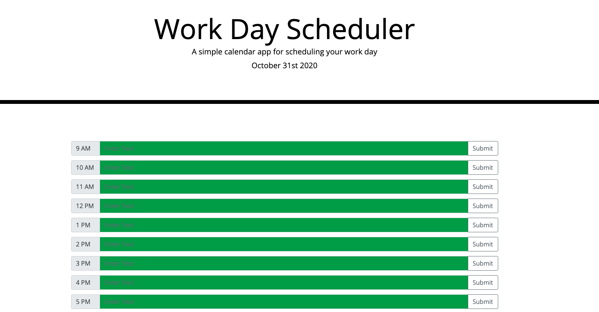

# My Day Scheduler 

## Repository

Are you a busy product manager or developer? If you're like me, we're constantly juggling what seems like a million tasks at once. It's been proven that when you put something down on "paper," you're more likely to achieve it. Setting up a structure so you don't spend all day doing the things you love, or alternatively spending excess time on something you get stuck on, can hurt your productivity. This scheduler will help you stay on track. 

The scheduler will automatically turn green if you still have time to plan something, it'll be gray during the current work hour, and it'll be red if you've already surpassed that time in the day. Lastly, if you still have time to plan, this scheduler will let you enter text and save it. 

Again, we know you're working hard. So hopefully this scheduler will help you do less thinking. Just jot your task down and look back to it whenever needed. Enjoy! 

Below I'll include a screenshot of what the page looks like:

Click [here](https://floressuarezalvaro.github.io/scheduler) to access the scheduler.

## Contributing

The best way to participate in my portfolio is to [submit a bug](https://github.com/floressuarezalvaro/scheduler/issues). Additionally, you can review the [source code](https://github.com/floressuarezalvaro/scheduler/pulls) changes. Lastly, you can [build from the source itself](https://github.com/floressuarezalvaro/scheduler/wiki).